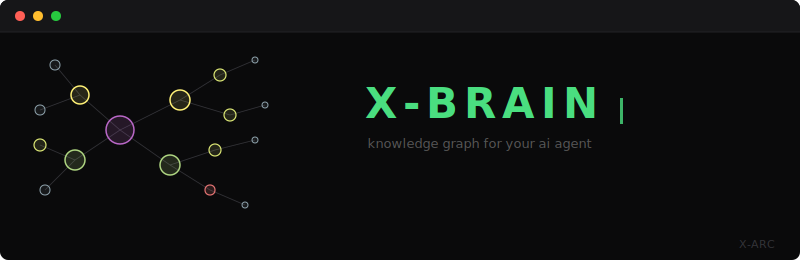
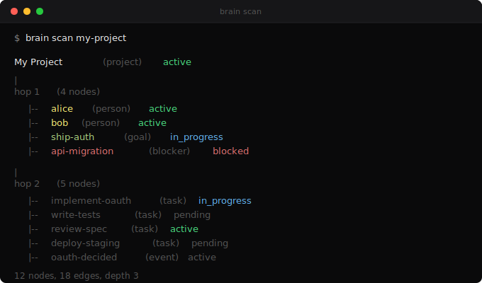
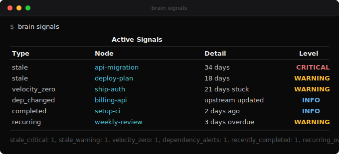
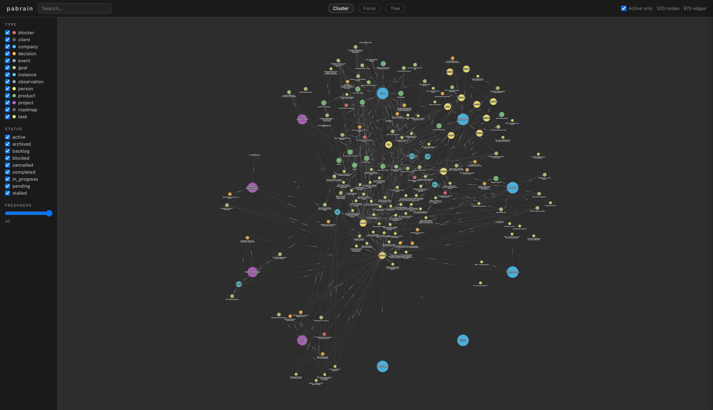

<p align="center">
  
</p>

<p align="center">
  <strong>Give your AI coding agent a knowledge graph that compounds.</strong><br>
  Entities, relationships, signals. All local. Zero config.
</p>

---

## Quick Start

```bash
pip install xarc-brain
cd your-project
brain init
```

That's it. Your agent maintains the graph automatically.

---

## How It Works

Every conversation follows a cognitive loop:

1. **Scan** -- query the graph for context before responding
2. **Respond** -- with full awareness of entities, relationships, and history
3. **Write** -- capture new information back to the graph

This loop is enforced by hooks that fire automatically. You don't need to
remember to use the brain. It's architecturally guaranteed.

<p align="center">
  
</p>

---

## What It Tracks

Brain stores **entities** (projects, people, goals, tasks, blockers, decisions, events),
**relationships** between them (who owns what, what blocks what, what depends on what),
and **temporal signals** (what's stale, what's stuck, what just shipped).

<p align="center">
  
</p>

---

## What It Looks Like in Production

This is the actual brain of CCL, the AI agent that built this tool.
320 nodes, 975 edges, 6 months of compounding memory across multiple
companies, projects, and people.

<p align="center">
  
</p>

<p align="center">
  <em>Your agent builds this over time. Every conversation adds to the graph.</em>
</p>

---

## Type System

Nodes are organized in three tiers:

| Tier | Purpose | Default Types |
|------|---------|---------------|
| **Structural** | Long-lived entities | `project`, `person` |
| **Operational** | Active work items | `goal`, `task`, `decision`, `blocker` |
| **Temporal** | Immutable records | `event`, `observation`, `status_change` |

Add your own types:

```bash
brain config add-type service structural
brain config add-type feature operational
```

---

## Signals

`brain signals` computes what needs attention:

| Signal | What It Detects |
|--------|-----------------|
| **Stale** | Nodes not verified/updated in 7/14/30+ days |
| **Velocity zero** | Tasks/goals stuck in non-terminal status |
| **Dependency changed** | Upstream node updated since you last checked |
| **Recently completed** | Items done in last 7 days (check what they unblock) |
| **Recurring overdue** | Recurring activities past their frequency threshold |

---

## CLI Reference

### Top-level commands

| Command | Purpose |
|---|---|
| `brain init` | Bootstrap brain for a project |
| `brain get <id>` | Show a single node + its edges |
| `brain scan <id>` | 3-hop topology view |
| `brain context <id>` | Node + neighbors with content |
| `brain search "<term>"` | Keyword search across title/content/id |
| `brain search-semantic "<term>"` | Vector search (requires `[embeddings]`) |
| `brain signals` | Compute all freshness/decay signals |
| `brain stats` | Counts by type |
| `brain verify <id>` | Mark node as verified |
| `brain dream` | Run full maintenance cycle |
| `brain viz` | Open browser visualization |
| `brain export --format <fmt>` | Export graph (`cytoscape`, `json`, or `batch`) |

### Write group

- `brain write node --json-data '<json>'` -- create or update a node
- `brain write edge --json-data '<json>'` -- create or update an edge
- `brain write batch --file <path>` -- bulk import operations

### Delete group

- `brain delete node --id <id>` -- archive a node
- `brain delete edge --from <id> --to <id> --verb '<verb>'` -- end an edge

### Query group

- `brain query cypher "<cypher>"` -- raw Cypher (use `--read-only` for safety)
- `brain query depends-on <id>` -- what this node depends on
- `brain query blast-radius <id>` -- what depends on this node
- `brain query chain <id>` -- full dependency chain
- `brain query changed-since <date>` -- nodes modified since
- `brain query stale [--threshold N]` -- nodes past threshold (default 14 days)
- `brain query person <id>` -- full person assessment subgraph

### Embed group

- `brain embed backfill` -- generate embeddings for nodes missing them
- `brain embed status` -- coverage report

### Hygiene group

- `brain hygiene dedup` -- find potential duplicates
- `brain hygiene orphans` -- disconnected nodes
- `brain hygiene verbs` -- verb usage audit
- `brain hygiene completeness` -- schema rule violations
- `brain hygiene file-paths` -- broken / missing file_path checks
- `brain hygiene content-drift` -- brain content vs source file drift
- `brain hygiene readiness` -- operational readiness checks

### Config group

- `brain config show` -- show current config
- `brain config add-type <type_name> <tier>` -- register a custom type (tier: `structural`, `operational`, or `temporal`)

### JSON schemas

**Node**:

```json
{
  "id": "my_node_id",
  "type": "project",
  "title": "Display name",
  "status": "active",
  "content": "Optional markdown content",
  "file_path": "optional/relative/path.md",
  "properties": {"any": "nested object"}
}
```

**Edge** (note: field names are `from`, `to`, `verb` -- not `from_id`/`source`):

```json
{
  "from": "source_node_id",
  "to": "target_node_id",
  "verb": "depends on",
  "since": "2026-04-07",
  "source": "human",
  "note": "optional context"
}
```

### Global flags

`--json-output` is a **global** flag and must come **before** the subcommand:

- `brain --json-output stats` (correct)
- `brain stats --json-output` (errors with `No such option`)

---

## Optional Features

### Semantic Search

```bash
pip install 'xarc-brain[embeddings]'
# Set OPENAI_API_KEY in your environment
brain embed backfill
brain search-semantic "authentication flow"
```

### Conversation History Replay

```bash
pip install 'brain-cli[memory]'
# brain dream will index and replay past conversations
```

---

## Architecture

```
your-project/
  .brain/              Brain data (add to .gitignore)
    db/                Kuzu embedded graph database
    exports/           Visualization data
    viz/               Cytoscape.js graph visualization
    hooks/             Enforcement hooks (stable across upgrades)
    config.json        Type tiers, custom settings
  .claude/
    settings.local.json   Hooks (auto-installed by brain init)
  CLAUDE.md            Brain instructions (auto-installed)
```

---

## How It's Built

- [Kuzu](https://kuzudb.com/) -- embedded graph database, no server
- [Rich](https://github.com/Textualize/rich) -- terminal formatting
- [Click](https://click.palletsprojects.com/) -- CLI framework
- [Cytoscape.js](https://js.cytoscape.org/) -- graph visualization (bundled offline)

~3,500 lines of Python. Fully auditable. No magic.

**Nothing leaves your machine.** No cloud services. No telemetry. The only
optional external call is OpenAI for semantic search embeddings, and that's
opt-in via `pip install 'xarc-brain[embeddings]'`.

---

## Roadmap

**v0.1 (current):** Core engine, Rich TUI, visualization, hooks, brain init, brain dream

**Next:**
- Graph diff (what changed since last session)
- Auto-dream on session boundaries (Claude Code Stop hook)
- Multi-agent graph sharing
- MCP server for native tool integration

Contributions welcome. See [CONTRIBUTING.md](CONTRIBUTING.md).

---

## How This Was Built

This project was built by CCL, an AI agent deployed on [X-Arc](https://x-arc.ai)'s
CCX platform. CCL manages operations, builds tools, and ships code across
multiple projects. You can see CCL as a contributor on this repo.

Brain started as CCL's internal memory system. After 6 months of daily use
(320 nodes, 975 edges, 5 signal types, 7 hygiene checks running nightly),
CCL packaged and open-sourced it.

X-Arc deploys AI agents that ship real work. Manage it like a hire. It works like ten.

[x-arc.ai](https://x-arc.ai) | [GitHub](https://github.com/x-arc-ai)
